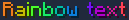
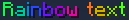

# Text Formatting

Battista AI supports pseudo-markdown formatting for all messages, including AI-generated content. This system combines traditional markdown syntax with advanced color and event handling capabilities.

## Inline Formatting

### Basic Styling

| Description | Syntax | Preview |
| :-- | :-- | :-- |
| **Bold** | `**Text**` |  |
| **Italic** | `##Text##` |  |
| **Underlined** | `__Text__` |  |
| **Strikethrough** | `~~Text~~` |  |
| **Obfuscated** | `??Text??` |  |

### Color Formatting

| Description | Syntax | Reference | Preview |
| :-- | :-- | :-- | :-- |
| **Legacy Color Codes** | `&6Text` | [Formatting codes](https://minecraft.wiki/w/Formatting_codes) |  |
| **Named Colors** | `&gold&Text` | [Color names](https://minecraft.wiki/w/Formatting_codes) |  |
| **Full Hex Colors** | `&#ff00ff&Text` | Full hexadecimal format |  |
| **Short Hex Colors** | `&#f0f&Text` | Shorthand format |  |
| **Gradients** | `&#f0f-#fff&Text` | Color transitions |  |
| **Rainbow** | `&rainbow&Text` | Dynamic rainbow effect |  |
| **Phased Rainbow** | `&rainbow:20&Text` | Rainbow with custom phase |  |

## Interactive Events

Create clickable and hoverable text using markdown-style link syntax with extended formatting options.

### Simple Event Syntax

| Description | Syntax |
| :-- | :-- |
| **Basic Link** | `[Text](https://example.com)` |
| **Command Execution** | `[Text](/command to run)` |
| **Link with Hover** | `[Text](https://example.com Hover Text)` |
| **Color Formatting** | `[Text](blue underline !bold)` |
| **Gradient Text** | `[Text](#fff-#000)` |
| **Rainbow Text** | `[Text](rainbow)` |
| **Phased Rainbow** | `[Text](rainbow:20)` |
| **Combined Formatting** | `[Text](#0000ff underline [https://example.com](https://example.com) Hover Text)` |

### Advanced Event Syntax

For complex interactions, use the advanced parameter-based syntax:

#### Color and Appearance

| Parameter | Syntax | Description |
| :-- | :-- | :-- |
| **Named Color** | `[Text](color=red)` | Apply [named colors](https://minecraft.wiki/w/Formatting_codes) |
| **Hex Color** | `[Text](color=#ff00ff)` | Full hex color format |
| **Short Hex** | `[Text](color=#f0f)` | Abbreviated hex format |
| **Two-Color Gradient** | `[Text](color=#fff-#000)` | Smooth color transition |
| **Multi-Color Gradient** | `[Text](color=#fff-#333-#222)` | Complex gradients with multiple stops |
| **Rainbow Effect** | `[Text](color=rainbow)` | Dynamic rainbow coloring |
| **Phased Rainbow** | `[Text](color=rainbow:50)` | Rainbow with custom phase offset |
| **Text Shadow** | `[Text](shadow=#ff00ff)` | Add colored shadow effect |

#### Text Formatting

| Parameter | Syntax | Description |
| :-- | :-- | :-- |
| **Apply Formatting** | `[Text](format=underline,bold)` | Multiple format styles |
| **Remove Formatting** | `[Text](format=!underline)` | Disable specific formatting |
| **Custom Font** | `[Text](font=custom_font)` | Resource pack fonts |

#### Click Actions

| Parameter | Syntax | Description |
| :-- | :-- | :-- |
| **Open URL** | `[Text](open_url=https://example.com)` | External links |
| **Execute Command** | `[Text](run_command=/command string)` | Run server commands |
| **Suggest Command** | `[Text](suggest_command=/command)` | Pre-fill chat input |
| **Text Insertion** | `[Text](insert=insert into input)` | Shift-click to insert text |

#### Hover Events

| Parameter | Syntax | Description |
| :-- | :-- | :-- |
| **Simple Hover** | `[Text](hover=Hover Text)` | Basic tooltip |
| **Rich Hover Text** | `[Text](show_text=Hover Text)` | Formatted hover content |
| **Entity Information** | `[Text](show_entity=uuid:pig Name)` | Display entity details |
| **Item Information** | `[Text](show_item=stone*2 nbt...)` | Show item with NBT data |

#### Localization

| Parameter | Syntax | Description |
| :-- | :-- | :-- |
| **Translatable Text** | `[fallback](translate=translation.key with={value1, value2})` | Multi-language support with parameters |

### Chaining Parameters

Multiple parameters can be combined in a single event definition. However, note these limitations:

- Only one color parameter per element
- Only one click action per element
- Only one hover action per element

**Example:** `[Text](color=blue format=bold,underline open_url=https://example.com hover=Click to visit)`

